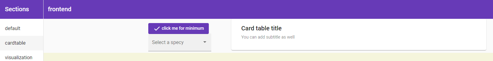

# R binding to Angular
This is an **Proof Of Concept** to bind rstats with Angular. R loves Angular and that's why I build this project.
This project will allow R users and developers to get access of the full capabilities of Angular framework. Minimal javascript knowledge is required.

# Requirements:

[Nodejs](https://nodejs.org/en/download/), [angular-cli](https://angular.io/cli), [angular-schematics](https://blog.angular.io/schematics-an-introduction-dc1dfbc2a2b2).

# Installation:

```r
library('devtools')
devtools::install_github('RanaivosonHerimanitra/Rangular')
```


## Design and philosophy:

The package will allow R user to build **reactive data driven application** by using the amazing power of Angular ecosystem such as [angular material](https://material.angular.io/components/categories) and [rxjs](https://rxjs-dev.firebaseapp.com/). 
R user describe what they want in R language. Example, a button to filter data on click, a dropdown to select a subset of the data, etc. Data are supplied from a R server using `Plumber` package and retrieved in a reactive manner using `rxjs`. Currently, vanilla rxjs string operations is supplied from within R, but one could easily construct wrappers around them.

Binding is made possible thanks to the [angular schematics](https://angular.io/guide/schematics).  We can generate a `typescript/html/css/json` templates using metadata supplied from the R functions we write.

### Why another R framework for building web application ?

This is not just another framework, it is an entire javascript ecosystem that will be binded using R syntax. Instead of reinventing the wheel, it will take the best in class framework to develop enterprise grade application using R. 

# Getting started (API usage):

Currently, you have to launch a plumber server, in a separate R session with CORS enabled. See [plumber page](https://www.rplumber.io/) for documentation. Once, a plumber server is launched, you can run the following code in a 2nd R session then visit url: http://localhost:4200

```r
library('Rangular')

# 02 examples function used as a method of a component, currently, 
## a vanilla string representing rxjs way of handling stream:

## orderBySepalLength will order data descending 

## giveMeMin retrieves iris data exposed in the api/iris
## endpoint and operates a min transformation to the data
## min will order iris object dataset with minimum value of field 'Sepal.Length'.
## and takes first value which corresponds to minimum Sepal.Length

orderBySepalLength = function() {
  return ("this.ds.getDataService('api/iris').pipe(min<any>( (a: any, b: any) => a['Sepal.Length'] < b['Sepal.Length'] ? -1 : 1)).subscribe((data: any) => this.data = data)")
}

giveMeMin = function() {
  return ("this.ds.getDataService('api/iris').pipe(min<any>( (a: any, b: any) => a['Sepal.Length'] < b['Sepal.Length'] ? -1 : 1), take(1)).subscribe((data: any) => this.data = data)")
}

## switchSpecies, will switch species based on the user chosen option. 
##For that, we use:
## filter operator from rxjs, to filter out species.
switchSpecies = function(event) {
  return("this.ds.getDataService('api/iris').pipe(map(data => data.filter(x => x['Species'] === event.value))).subscribe((data: any) => this.data = data)")
}

## For a complete list of possible operators, see rxjs: https://rxjs.dev/api/operators

# example usage Build 02 components and append then to the application:

component1 = Component$new(url="/",
                           name="data-manipulation",
                           view=list(view="table",columns=c("Sepal.Length","Petal.Length","Species")),
                           methods= list(MatButton = list(data = "api/iris", 
                                                          event = "click",
                                                          callback = orderBySepalLength, 
                                                          arguments=""),
                                         MatSelect = list(data = "api/iris", 
                                                          event = "selectionChange",
                                                          callback = switchSpecies, 
                                                          arguments="$event",
                                                          options=c("setosa","versicolor","virginica")))
                           )
component2 = Component$new(url="/cardtable",
                           name="data-visualization",
                           view=list(view="mat-card",columns=c("Sepal.Length","Petal.Length","Species")),
                           methods= list(MatButton = list(data = "api/iris", 
                                                          event = "click",
                                                          callback = giveMeMin,
                                                          arguments=""),
                                         MatSelect = list(data = "api/iris", 
                                                          event = "selectionChange",
                                                          callback = switchSpecies, 
                                                          arguments="$event",
                                                          options=c("setosa","versicolor","virginica")))
                           )

app = RAngular$new()
## directory must be the directory of your Rangular package:
app$buildFrontEnd(directory="C:/Users/Admin/Documents/Rangular/",
                  servicePort="{YOUR_BACKEND_SERVICE_PORT_NUMBER}",
                  name="example", 
                  components= list(component1, component2))
app$serve("example")
```

## Overview of a modern application structure:

A modern javascript application is divided into components. In the above example, we defined 02 components in 02 different urls (http://localhost:4200/default, http://localhost:4200/barchart). Each component holds its own logic surrounded by methods which control the data. Components have widgets (we aim to support all angular material components). They are used to display the data coming from api endpoint defined by `data`.
Views are predefined angular components that are used to display the data.


